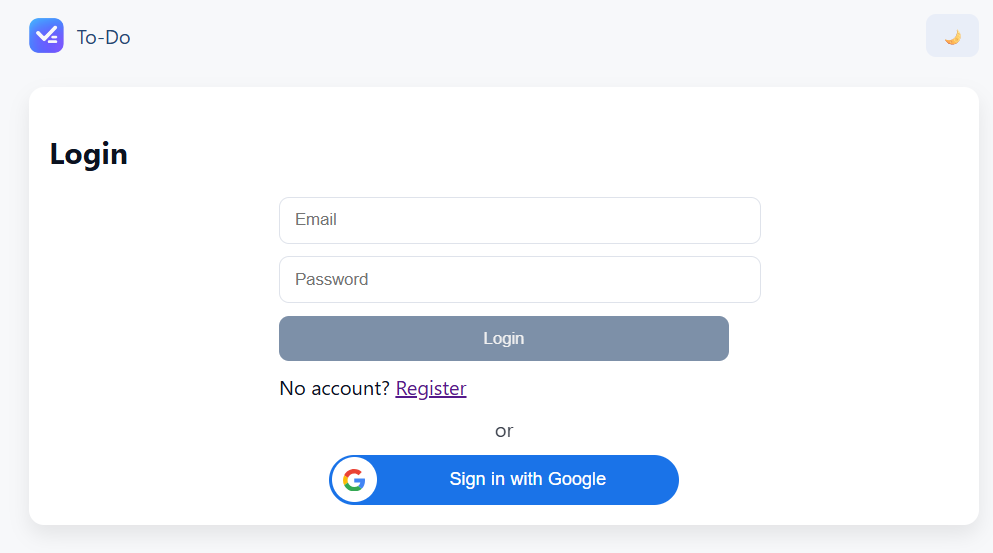
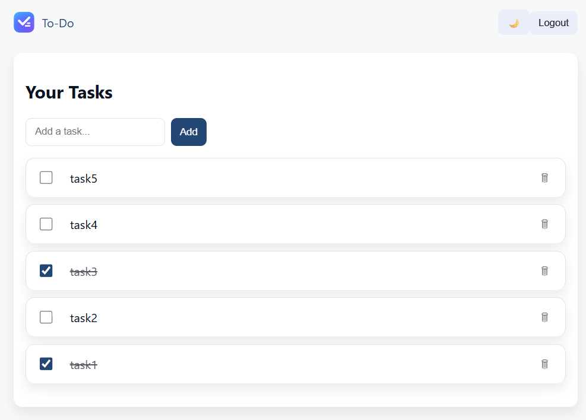
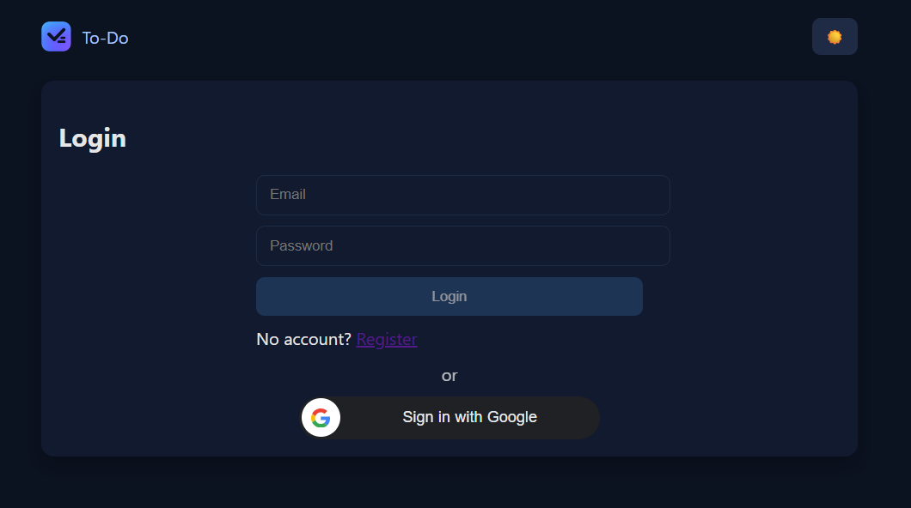
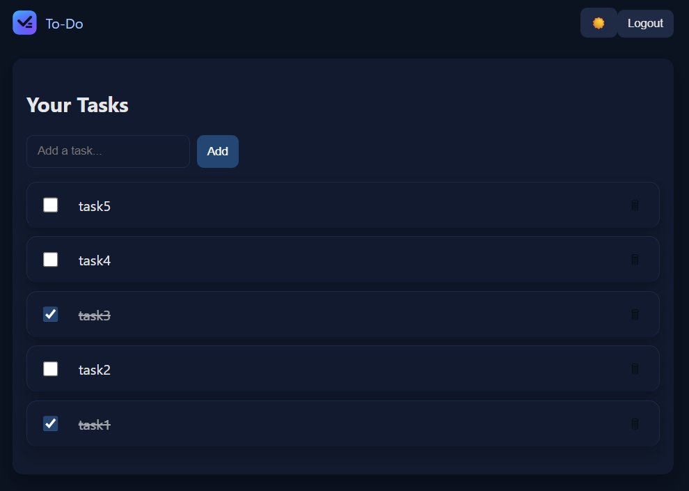

# 📝 Todo‑MERN

A modern full‑stack task management app built with the MERN stack, featuring secure user authentication & seamless CRUD operations.

---

## 🔑 Features

- **Secure User Login & Signup** using hashed passwords (bcrypt) and JWT-based sessions.
- **Task Management**: add, update, complete/incomplete, and delete to-dos with ownership enforced per user.
- **Responsive Frontend** built in React with Hooks, Context API, React Router, and styled using Bootstrap.
- **Cloud Data Persistence** on MongoDB Atlas via Mongoose ODM for safe and scalable storage.
- **Friendly UI & Real-Time Interaction** using Axios for seamless server communication.

---

## 🛠️ Getting Started

```bash
git clone https://github.com/Techietal/ToDo_MERN.git
cd ToDo_MERN

# Backend setup
cd server
npm install
cp .env.example .env
# Set MONGO_URI and optionally PORT in .env
npm run dev

# Frontend setup
cd ../client
npm install
npm run dev
```

Visit [**http://localhost:5173**](http://localhost:5173) in your browser to begin using the app.

---

## 📸 Screenshots

**LIGHT MODE**

<p align="center">
  
</p>

<p align="center">
  
</p>

**DARK MODE**

<p align="center">
  
</p>

<p align="center">
  
</p>

---

## 🚀 Tech Stack

| Layer        | Technologies                                |
| ------------ | ------------------------------------------- |
| **Frontend** | React.js, React Router, Axios, Bootstrap    |
| **Backend**  | Node.js, Express.js                         |
| **Database** | MongoDB Atlas, Mongoose ODM                 |
| **Security** | bcrypt (password hashing), JWT (token auth) |

---

## 🎓 Why Use This?

This app is ideal for developers learning full-stack JavaScript, offering a clean architecture with authentication, secure CRUD, and a responsive UI. It’s also easily extendable—customize or deploy it as your own productivity tool.

---

## 📄 License

MIT License – see the LICENSE file for details.

